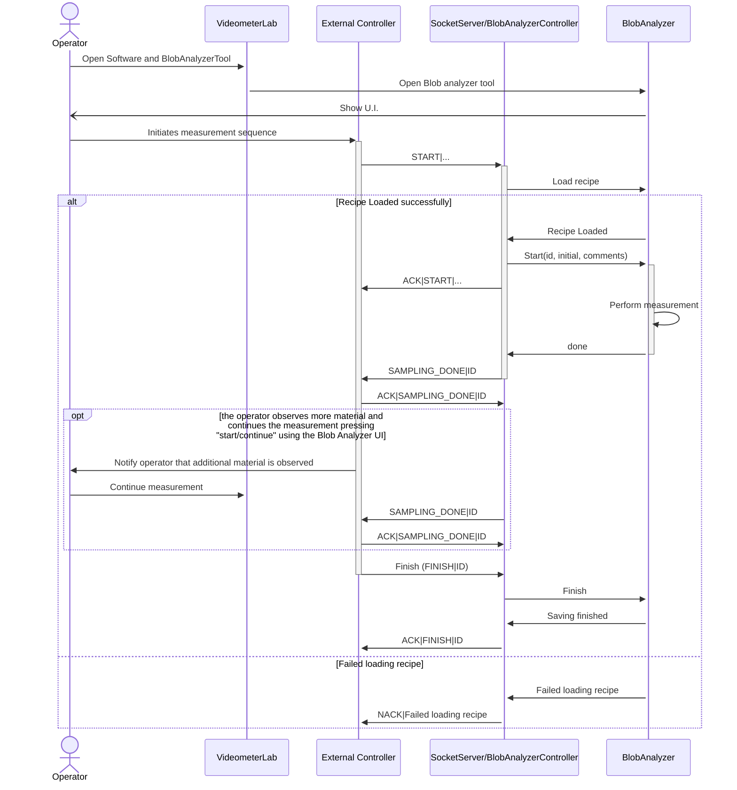
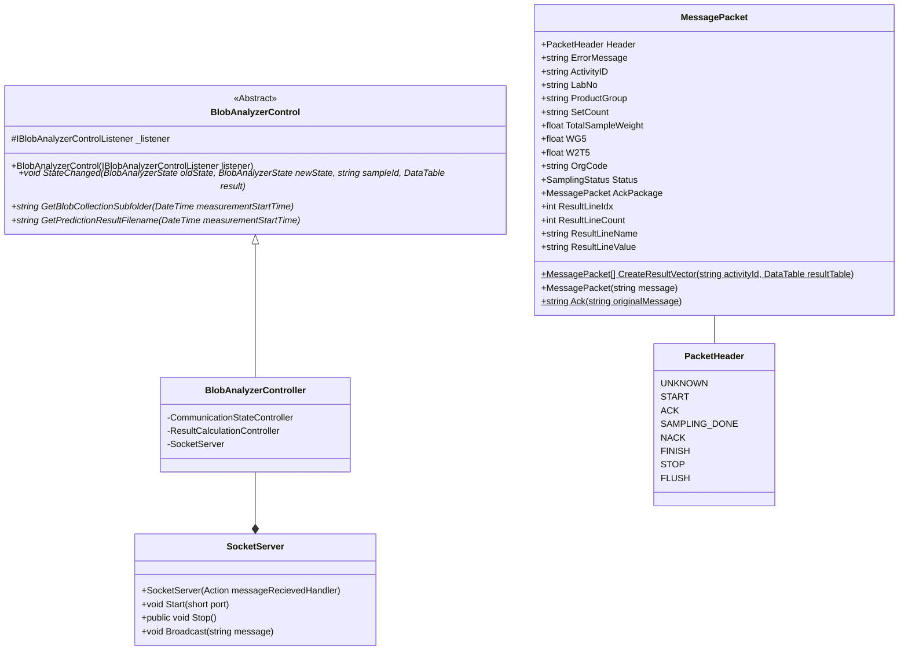

# Communication interface used for controlling the BlobAnalyzer
<!-- TOC -->
* [Communication interface used for controlling the BlobAnalyzer](#communication-interface-used-for-controlling-the-blobanalyzer)
* [Supported commands:](#supported-commands-)
  * [START](#start)
  * [SAMPLING_DONE](#sampling_done)
  * [STOP](#stop)
  * [FLUSH](#flush)
  * [FINISH](#finish)
  * [Example transaction after the blobAnalyzer is started](#example-transaction-after-the-blobanalyzer-is-started)
* [Technical details](#technical-details)
  * [BlobAnalyzercontroller](#blobanalyzercontroller)
  * [SocketServer](#socketserver)
<!-- TOC -->


# Supported commands:
The Communication protocol relates to messages between the socket server and External controller

## START
Starts a new measurement, start is send from external controller, the recipe is loaded and the blob analyzer starts analyzing, if state and recipe is valid the acknowledge is send back with the original message (ACK)
```text
START|Sample Id|Recipe name|Operator|Comment
ACK|START|Sample Id|Recipe name|Operator|Comment
```

## SAMPLING_DONE
When all product was presented the Blob analyzer sends SAMPLING_DONE, the external controller should reply with ACK and the original message. To Finish the measurement, send the Finish Command.
```text
SAMPLING_DONE|Sample Id
ACK|SAMPLING_DONE|Sample Id
```

## STOP
Stops analysis or flushing, corresponds to pressing the stop button on the user interface, the device will not empty/flush after this command
```text
STOP
ACK|STOP
```

## FLUSH
Flushes conveyor or vacuums the X/Y plate
```text

FLUSH
ACK|FLUSH
```

## FINISH
Saves the generated results and blob collections, _Notice_, this can only be called after a measurement was made and the device is in the stopped state
```text
FINISH
ACK|FINISH
```

## Example transaction after the blobAnalyzer is started
```text
>> Customer: START|lot543887|Corn_2022_v2|CHG|A test measurement
<< VMController: ACK|START|lot543887|Corn_2022_v2|CHG|A test measurement
<< VMController: SAMPLING_DONE
>> Customer: ACK|SAMPLING_DONE
>> Customer: FINISH
<< VMController: ACK|FINISH
```

# Technical details

## BlobAnalyzercontroller
Handles message generation and consumption between controller/PLC and BlobAnalyzer, the commands are send to the BlobAnalyzer via the _IBlobAnalyzerControlListener

## SocketServer
Raw socket server that creates a socket server and forwards messages to the BlobAnalyzerController

A more detailed sequence diagram is shown below


